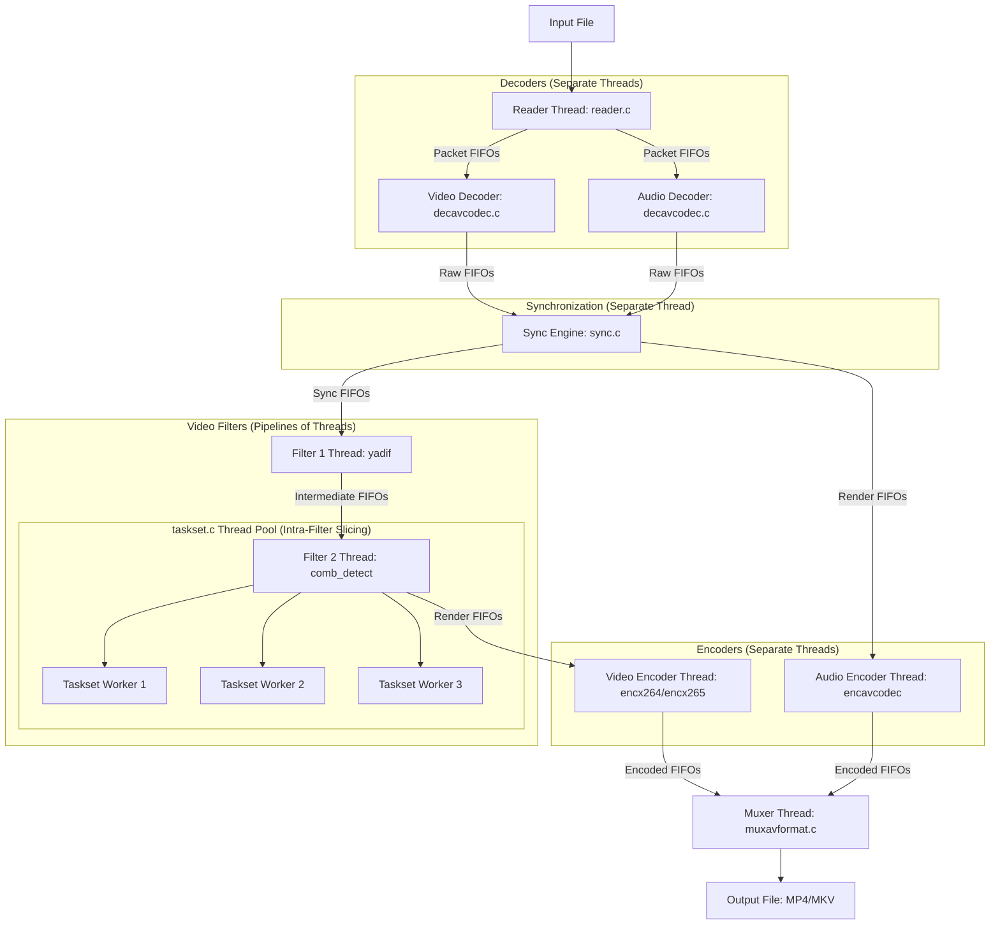

# Swift Architecture & Task Distribution Reference

This document provides a comprehensive overview of the **Swift** (HandBrake-based) architecture, detailing its file structure, code modules, and task distribution mechanisms (concurrency and thread-level parallelism).

---

## 1. High-Level Directory Structure

```
Swift/
├── contrib/            # Build instructions and patches for 3rd-party dependencies
├── gtk/                # Linux GTK user interface source code
├── macosx/             # macOS native User Interface (Swift/ObjC) source code
├── win/                # Windows native User Interface (C#/.NET) source code
├── make/               # Python-based configure and build system scripts
├── test/               # HandBrakeCLI (test.c) source code and CLI harness
├── scripts/            # Release, localization, and packaging scripts
└── libhb/              # Core transcoding engine library (written in C)
    ├── handbrake/      # Public/Internal API header files (.h)
    └── platforms/      # OS-specific hardware acceleration modules
```

---

## 2. Core Task Distribution & Concurrency Model

Swift employs a **hybrid multithreading model** to maximize CPU utilization:
1. **Pipeline Parallelism (Inter-Module)**: Splitting stages of transcoding (read, decode, sync, filter, encode, mux) into separate threads linked via thread-safe FIFOs.
2. **Data Parallelism (Intra-Module)**: Splitting CPU-heavy filtering or encoding tasks (e.g., frame slices) across multiple threads using a fork-join worker pool.



### A. Inter-Module Pipeline Parallelism (FIFOs)
Transcoding tasks are split into functional blocks called **Work Objects** (`hb_work_object_t`). Each work object runs in its own OS thread.
- **Thread Lifecycle**: Managed in [libhb/work.c](file:///home/harshit/Pending/Swift/libhb/work.c) via `hb_work_loop` and `filter_loop`.
- **FIFO Queues (`hb_fifo_t`)**: Defined in [libhb/fifo.c](file:///home/harshit/Pending/Swift/libhb/fifo.c), these are thread-safe ring-buffers using mutexes and condition variables to manage flow control. If a queue fills up, the producer thread blocks; if it is empty, the consumer thread blocks.

### B. Intra-Module Data Parallelism (Tasksets)
For CPU-bound video filters, pipeline parallelism is insufficient. Swift utilizes a custom **Fork-Join Worker Pool** called **Tasksets**:
- **Taskset Lifecycle**: Defined in [libhb/taskset.c](file:///home/harshit/Pending/Swift/libhb/taskset.c) and header [libhb/handbrake/taskset.h](file:///home/harshit/Pending/Swift/libhb/handbrake/taskset.h).
- **Execution Mechanism**:
  1. A filter initializes a taskset (`taskset_init`) spawning $N$ worker threads.
  2. The worker threads block waiting on a conditional variable `begin_cond`.
  3. When a frame is received, the filter splits the frame into $N$ horizontal segments (slices) and triggers the workers using `taskset_cycle`.
  4. Workers process their segments and signal `complete_cond`.
  5. The calling filter thread blocks on `complete_cond` until all workers finish, then proceeds.

---

## 3. Core Files in `libhb/` and Interface Matrix

| File Path | Component | Description | Key Interfacing Files |
| :--- | :--- | :--- | :--- |
| [`libhb/hb.c`](file:///home/harshit/Pending/Swift/libhb/hb.c) | **Library Core** | Global initialization, setup, and job queueing. Main entry point for frontend bindings. | Interfaces with `work.c` (spawns the work orchestrator thread) and `preset.c`. |
| [`libhb/work.c`](file:///home/harshit/Pending/Swift/libhb/work.c) | **Work Orchestrator** | Instantiates work objects, allocates input/output FIFOs, starts pipeline threads, and monitors job progress. | Interfaces with `hb.c` (job caller), `fifo.c` (pipeline queues), and all decoder/encoder modules. |
| [`libhb/fifo.c`](file:///home/harshit/Pending/Swift/libhb/fifo.c) | **Data Buffers** | Thread-safe FIFO queue implementation with write-blocking and read-blocking flow control. | Utilized by almost all pipeline files, particularly `work.c`, `sync.c`, decoders, and encoders. |
| [`libhb/taskset.c`](file:///home/harshit/Pending/Swift/libhb/taskset.c) | **Thread Pool** | Thread synchronization framework for parallel frame/slice filtering. | Linked by parallel filters like `comb_detect.c`, `nlmeans.c`, `decomb.c`, and `yadif`. |
| [`libhb/sync.c`](file:///home/harshit/Pending/Swift/libhb/sync.c) | **Sync Engine** | The Audio/Video sync manager. Matches PTS (Presentation Timestamps), inserts dummy frames, or drops frames. | Receives from decoders (`decavcodec.c`) and outputs to filters (`avfilter.c`) and encoders. |
| [`libhb/ports.c`](file:///home/harshit/Pending/Swift/libhb/ports.c) | **OS Abstraction** | Implements wrappers for thread creation, mutexes, condition variables, and platform helpers (POSIX vs. Win32). | Included globally; links OS calls to `fifo.c`, `taskset.c`, and thread wrappers. |
| [`libhb/reader.c`](file:///home/harshit/Pending/Swift/libhb/reader.c) / `stream.c` | **Demuxer** | Opens input files/streams, demuxes tracks, and sends packets to codec-specific FIFO queues. | Interfaces with FFmpeg libraries and feeds packet buffers into `work.c`/`decavcodec.c`. |
| [`libhb/decavcodec.c`](file:///home/harshit/Pending/Swift/libhb/decavcodec.c) | **Decoder Wrapper** | Configures and runs FFmpeg `libavcodec` decoders for audio and video streams. | Consumes packet FIFOs from `reader.c` and feeds raw frame FIFOs to `sync.c`. |
| [`libhb/encx264.c`](file:///home/harshit/Pending/Swift/libhb/encx264.c) / `encx265.c` | **Video Encoders** | Wraps `libx264` and `libx265` for H.264/AVC and H.265/HEVC encoding. | Consumes render FIFOs from filters, uses encoder internal threading, and outputs to `muxavformat.c`. |
| [`libhb/encsvtav1.c`](file:///home/harshit/Pending/Swift/libhb/encsvtav1.c) | **AV1 Encoder** | Integrates SVT-AV1 encoder for AV1 video encoding. | Receives filtered frames, configures SVT-AV1 threading, and outputs to `muxavformat.c`. |
| [`libhb/muxavformat.c`](file:///home/harshit/Pending/Swift/libhb/muxavformat.c) | **Muxer** | Uses FFmpeg `libavformat` to pack encoded tracks into MP4/MKV/WebM files. | Consumes encoded packet streams from all encoder threads and writes final bytes to disk. |

---

## 4. Step-by-Step Code Linkage & Execution Flow

To trace how a transcode job is processed step-by-step through these files:

### Step 1: Initializing the Library
- The UI (GTK, macOS, Win UI) or the CLI ([`test/test.c`](file:///home/harshit/Pending/Swift/test/test.c)) calls `hb_init()` in [`libhb/hb.c`](file:///home/harshit/Pending/Swift/libhb/hb.c).
- This initializes the thread primitives, filters, encoders, and hardware decoders via platform abstraction in [`libhb/ports.c`](file:///home/harshit/Pending/Swift/libhb/ports.c).

### Step 2: Job Queueing and Thread Spawning
- The caller adds jobs and triggers execution by calling `hb_start()`.
- `hb_start()` spawns the main control thread running `hb_work_init` in [`libhb/work.c`](file:///home/harshit/Pending/Swift/libhb/work.c).
- `work_func` in `work.c` loops through active jobs and invokes `do_job(job)`.

### Step 3: Pipeline Setup
- Inside `do_job`, the pipeline of threads is constructed:
  1. Spawns `WORK_READER` running [`libhb/reader.c`](file:///home/harshit/Pending/Swift/libhb/reader.c).
  2. Spawns audio/video decoder threads running [`libhb/decavcodec.c`](file:///home/harshit/Pending/Swift/libhb/decavcodec.c).
  3. Spawns `WORK_SYNC_VIDEO` running [`libhb/sync.c`](file:///home/harshit/Pending/Swift/libhb/sync.c).
  4. Spawns individual filter threads (e.g., `decomb`, `denoise`) configured in `do_job`'s filter list.
  5. Spawns encoder threads (e.g., [`libhb/encx264.c`](file:///home/harshit/Pending/Swift/libhb/encx264.c)).
  6. Spawns `WORK_MUX` running [`libhb/muxavformat.c`](file:///home/harshit/Pending/Swift/libhb/muxavformat.c).
- Each thread is initialized with input/output [`libhb/fifo.c`](file:///home/harshit/Pending/Swift/libhb/fifo.c) buffer pointers.

### Step 4: The Transcoding Loop
- **Demuxing**: `reader.c` extracts packets and pushes them into `fifo_in` (for decoders).
- **Decoding**: `decavcodec.c` pulls packets, decodes them to raw frames, and pushes them into `fifo_raw`.
- **Syncing**: `sync.c` pulls raw frames, aligns audio and video PTS, and writes synchronized frames to `fifo_sync`.
- **Filtering**: Filters pull frames from `fifo_sync`. CPU-heavy filters like `comb_detect.c` trigger `taskset_cycle` ([`libhb/taskset.c`](file:///home/harshit/Pending/Swift/libhb/taskset.c)) to parallelize pixel-processing across all cores.
- **Encoding**: Encoders pull filtered frames from `fifo_render`, compress them, and push packets to `fifo_out`.
- **Muxing**: `muxavformat.c` pulls compressed packets and writes them to the output container.

### Step 5: Joining Threads and Teardown
- Once `reader.c` hits EOF, it propagates a special flush/EOF buffer down the FIFO chain.
- As each step finishes processing and flushes its queues, its work thread terminates.
- When `muxavformat.c` completes and exits, the orchestrator thread (`do_job`) joins all work threads, frees memory buffers via `hb_fifo_close()`, and reports completion to `hb.c` via `SetWorkStateInfo()`.
