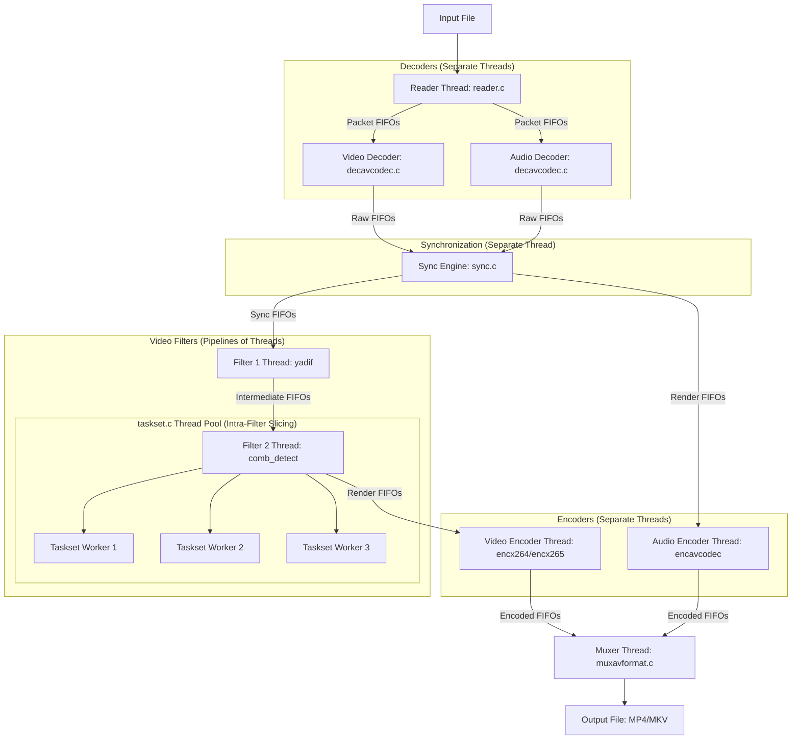

# Swift (HandBrake) Comprehensive Architecture, Folders & Task Distribution Reference

This reference documents **every directory, subdirectory, and core file** in the Swift workspace, defining their roles and how they are linked across the project.

---

## 1. Complete Folder & Directory Catalog

At the root directory (`/home/harshit/Pending/Swift`), the folders are defined as follows:

### 📁 `libhb/`
* **Role**: The core transcoding engine. Written in C, it implements demuxing, decoding, filtering, synchronization, and encoding pipelines.
* **Key Subfolders**:
  * **`libhb/handbrake/`**: Internal/public API header files (e.g. [`handbrake.h`](file:///home/harshit/Pending/Swift/libhb/handbrake/handbrake.h), [`common.h`](file:///home/harshit/Pending/Swift/libhb/handbrake/common.h), [`ports.h`](file:///home/harshit/Pending/Swift/libhb/handbrake/ports.h)).
  * **`libhb/platform/macosx/`**: VideoToolbox hardware encoder/decoder and Apple Metal GPU shader adapters (`encvt.c`, `comb_detect_vt.m`).
  * **`libhb/templates/`**: Performance optimization code templates for filters like `comb_detect_template.c` and `decomb_template.c`.

### 📁 `contrib/`
* **Role**: Custom compilation rules (make definitions) for third-party dependencies.
* **Key Subfolders**:
  * **`contrib/ffmpeg/`**: Build recipe for FFmpeg.
  * **`contrib/x264/`** / **`contrib/x265/`** / **`contrib/svt-av1/`**: Video encoder libraries recipes.
  * **`contrib/libvpl/`**: Intel QSV (VPL) library recipe.
  * **`contrib/[others]/`**: Build recipes for helper libraries like libass, zimg, fribidi, ogg, vorbis, opus, etc.

### 📁 `download/`
* **Role**: Local cache for downloaded package source tarballs (e.g., `ffmpeg-8.1.1.tar.bz2`, `x265_4.2.tar.gz`) used by the `contrib` recipes during compilation to build the transcoding environment.

### 📁 `graphics/`
* **Role**: Holds application assets, including logos, visual icons for standard interfaces, and graphics license files.

### 📁 `preset/`
* **Role**: Contains default encoding definitions.
* **Key Files**:
  * **`preset_builtin.json`**: Configures all built-in encoding presets (Web, Devices, Matroska, General formats).
  * **`preset_cli_default.json`**: Fallback presets for CLI execution.

### 📁 `pkg/`
* **Role**: Directs packaging rules for platform distributions.
* **Key Subfolders**:
  * **`pkg/darwin/`**: Package building for macOS app bundles and disk images (`.dmg`).
  * **`pkg/linux/`**: Rules for building Flatpak manifests and appstream definitions.
  * **`pkg/mingw/`**: Windows installer scripts.

### 📁 `make/`
* **Role**: The core build configure environment.
* **Key Subfolders & Files**:
  * **`make/configure.py`**: Python configuration script validating OS, environment flags, and writing the final Makefile.
  * **`make/include/`**: Internal make definitions specifying compiler flags (`gcc.defs`) and dependency recipes (`contrib.defs`).
  * **`make/cross/`**: Toolchain instructions for compiling Windows/ARM64 binaries.

### 📁 `test/`
* **Role**: Codebase for the command-line interface `HandBrakeCLI`.
* **Key Files**:
  * **[`test/test.c`](file:///home/harshit/Pending/Swift/test/test.c)**: Argument parser and wrapper executing jobs.
  * **[`test/parsecsv.c`](file:///home/harshit/Pending/Swift/test/parsecsv.c)**: CSV parsing utility.

### 📁 `gtk/` / `macosx/` / `win/`
* **Role**: Native graphical user interfaces:
  * **`gtk/`**: Linux UI source files (C/GTK4).
  * **`macosx/`**: macOS UI source files (Swift/Objective-C Cocoa).
  * **`win/`**: Windows UI source files (C#/.NET WPF).

### 📁 `build*/` (e.g. `build-linux-x64/`, `build-linux-arm64/`)
* **Role**: Target workspaces containing compiled object files, intermediate static libraries, and output binaries.

### 📁 `.github/`
* **Role**: Pull request templates, issue guidelines, and workflow definitions (`.github/workflows/linux.yml`) for automated CI builds.

---

## 2. Core Task Distribution & Concurrency Model

Swift employs a **hybrid multithreading model** to maximize CPU utilization:
1. **Pipeline Parallelism (Inter-Module)**: Splitting stages of transcoding (read, decode, sync, filter, encode, mux) into separate threads linked via thread-safe FIFOs.
2. **Data Parallelism (Intra-Module)**: Splitting CPU-heavy filtering or encoding tasks (e.g., frame slices) across multiple threads using a fork-join worker pool.

### A. Inter-Module Pipeline Parallelism (FIFOs)
Transcoding tasks are split into functional blocks called **Work Objects** (`hb_work_object_t`). Each work object runs in its own OS thread.
- **Thread Lifecycle**: Managed in [libhb/work.c](file:///home/harshit/Pending/Swift/libhb/work.c) via `hb_work_loop` and `filter_loop`.
- **FIFO Queues (`hb_fifo_t`)**: Defined in [libhb/fifo.c](file:///home/harshit/Pending/Swift/libhb/fifo.c), these are thread-safe ring-buffers using mutexes and condition variables to manage flow control. If a queue fills up, the producer thread blocks; if it is empty, the consumer thread blocks.

### B. Intra-Module Data Parallelism (Tasksets)
For CPU-bound video filters, pipeline parallelism is insufficient. Swift utilizes a custom **Fork-Join Worker Pool** called **Tasksets**:
- **Taskset Lifecycle**: Defined in [libhb/taskset.c](file:///home/harshit/Pending/Swift/libhb/taskset.c) and header [libhb/handbrake/taskset.h](file:///home/harshit/Pending/Swift/libhb/handbrake/taskset.h).
- **Execution Mechanism**:
  1. A filter initializes a taskset (`taskset_init`) spawning $N$ worker threads.
  2. The worker threads block waiting on a conditional variable `begin_cond`.
  3. When a frame is received, the filter splits the frame into $N$ horizontal segments (slices) and triggers the workers using `taskset_cycle`.
  4. Workers process their segments and signal `complete_cond`.
  5. The calling filter thread blocks on `complete_cond` until all workers finish, then proceeds.

---

## 3. Core Files in `libhb/` and Interface Matrix

| File Path | Component | Description | Key Interfacing Files |
| :--- | :--- | :--- | :--- |
| [`libhb/hb.c`](file:///home/harshit/Pending/Swift/libhb/hb.c) | **Library Core** | Global initialization, setup, and job queueing. Main entry point for frontend bindings. | Interfaces with `work.c` (spawns the work orchestrator thread) and `preset.c`. |
| [`libhb/work.c`](file:///home/harshit/Pending/Swift/libhb/work.c) | **Work Orchestrator** | Instantiates work objects, allocates input/output FIFOs, starts pipeline threads, and monitors job progress. | Interfaces with `hb.c` (job caller), `fifo.c` (pipeline queues), and all decoder/encoder modules. |
| [`libhb/fifo.c`](file:///home/harshit/Pending/Swift/libhb/fifo.c) | **Data Buffers** | Thread-safe FIFO queue implementation with write-blocking and read-blocking flow control. | Utilized by almost all pipeline files, particularly `work.c`, `sync.c`, decoders, and encoders. |
| [`libhb/taskset.c`](file:///home/harshit/Pending/Swift/libhb/taskset.c) | **Thread Pool** | Thread synchronization framework for parallel frame/slice filtering. | Linked by parallel filters like `comb_detect.c`, `nlmeans.c`, `decomb.c`, and `yadif`. |
| [`libhb/sync.c`](file:///home/harshit/Pending/Swift/libhb/sync.c) | **Sync Engine** | The Audio/Video sync manager. Matches PTS (Presentation Timestamps), inserts dummy frames, or drops frames. | Receives from decoders (`decavcodec.c`) and outputs to filters (`avfilter.c`) and encoders. |
| [`libhb/ports.c`](file:///home/harshit/Pending/Swift/libhb/ports.c) | **OS Abstraction** | Implements wrappers for thread creation, mutexes, condition variables, and platform helpers (POSIX vs. Win32). | Included globally; links OS calls to `fifo.c`, `taskset.c`, and thread wrappers. |
| [`libhb/reader.c`](file:///home/harshit/Pending/Swift/libhb/reader.c) / `stream.c` | **Demuxer** | Opens input files/streams, demuxes tracks, and sends packets to codec-specific FIFO queues. | Interfaces with FFmpeg libraries and feeds packet buffers into `work.c`/`decavcodec.c`. |
| [`libhb/decavcodec.c`](file:///home/harshit/Pending/Swift/libhb/decavcodec.c) | **Decoder Wrapper** | Configures and runs FFmpeg `libavcodec` decoders for audio and video streams. | Consumes packet FIFOs from `reader.c` and feeds raw frame FIFOs to `sync.c`. |
| [`libhb/encx264.c`](file:///home/harshit/Pending/Swift/libhb/encx264.c) / `encx265.c` | **Video Encoders** | Wraps `libx264` and `libx265` for H.264/AVC and H.265/HEVC encoding. | Consumes render FIFOs from filters, uses encoder internal threading, and outputs to `muxavformat.c`. |
| [`libhb/encsvtav1.c`](file:///home/harshit/Pending/Swift/libhb/encsvtav1.c) | **AV1 Encoder** | Integrates SVT-AV1 encoder for AV1 video encoding. | Receives filtered frames, configures SVT-AV1 threading, and outputs to `muxavformat.c`. |
| [`libhb/muxavformat.c`](file:///home/harshit/Pending/Swift/libhb/muxavformat.c) | **Muxer** | Uses FFmpeg `libavformat` to pack encoded tracks into MP4/MKV/WebM files. | Consumes encoded packet streams from all encoder threads and writes final bytes to disk. |
| [`libhb/comb_detect.c`](file:///home/harshit/Pending/Swift/libhb/comb_detect.c) / `nlmeans.c` / `avfilter.c` | **Filters** | Computational filters executing frame preprocessing algorithms. | Triggers `taskset_cycle()` to distribute slice rendering. |
